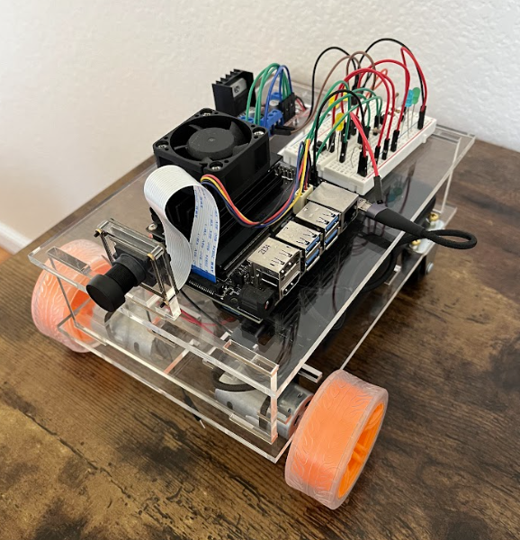
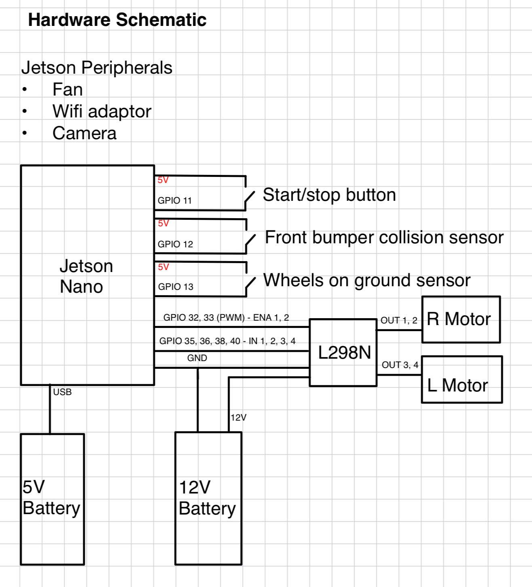

# jetson_car

Self-driving car project. It's still in progress, being built to autonomously drive around a track as quickly as possible. It uses edge detection to find the sides of the path and then passes that edge tensor into a model that calculates a steering command to keep the robot on the path.

(I still need to come up with a proper name for it 😂)

## Software
- JetPack SDK
- Python 3.6.9
- Libraries: RPi.GPIO 0.7.1
- SolidWorks 2022

## Hardware
- Nvidia Jetson Nano
- L298N DC Motor Driver
- 2 PM DC Motors (6-12V)

Schematic:

